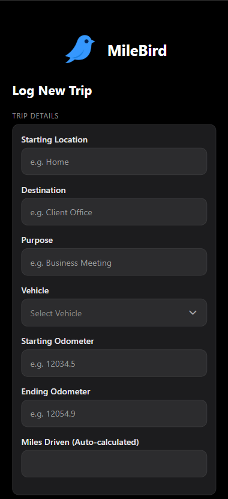
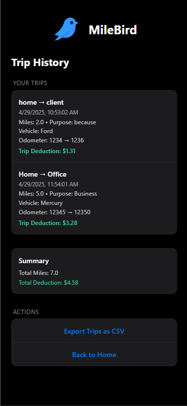
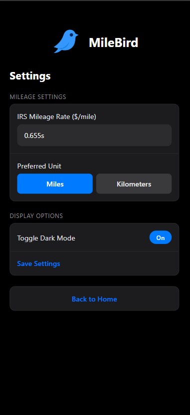

# 📍 MileMonkey

**MileMonkey** is a clean, modern, iOS-native inspired mileage tracking app —
designed to be the sleek, elegant successor to the original MileBug app.

Built with **Expo**, **React Native**, and **iOS HIG** (Human Interface Guidelines) styling in mind.  
Seamlessly log trips, calculate mileage deductions, manage vehicles, and export your trip history — all with a fully offline-first experience.

---

## 🚀 Features

- ✏️ **Log Trips**  
  Record start location, destination, vehicle, purpose, odometer readings, and miles automatically.

- 🚗 **Manage Vehicles**  
  Add and manage your personal or business vehicles with swipe-to-delete gestures.

- 📈 **Automatic Deduction Calculations**  
  Calculates IRS-standard mileage deductions based on your configured rate.

- 📤 **Export Trips as CSV**  
  Export your full trip history with one tap to share, download, or email.

- 🌔 **Native Dark Mode**  
  Fully responsive to system appearance — gorgeous in both Light and Dark modes.

- 📦 **Offline Ready**  
  Stores all trip and vehicle data locally using AsyncStorage — no account required.

- 🔥 **iOS-Native Feel**  
  Grouped list styling, soft shadows, haptic feedback, animated chevrons — designed to feel truly at home on iPhone.

---

## 🛠️ Tech Stack

| Technology                       | Purpose                                                |
| -------------------------------- | ------------------------------------------------------ |
| **React Native + Expo**          | Core framework and cross-platform runtime              |
| **AsyncStorage**                 | Local storage for trips, vehicles, and settings        |
| **expo-sharing**                 | File sharing for CSV exports                           |
| **expo-file-system**             | Temporary file management                              |
| **react-native-gesture-handler** | Swipe-to-delete functionality                          |
| **expo-haptics**                 | Native tactile feedback on user actions                |
| **Custom iOS UI**                | Settings-style grouped cards, animations, soft styling |

---

## 📷 Screenshots

|                     Home                      |                   New Trip                    |                 Trip History                 |                    Settings                    |
| :-------------------------------------------: | :-------------------------------------------: | :------------------------------------------: | :--------------------------------------------: |
|  |  |  |  |

---

## 📦 Setup

1. **Clone the repository**

```bash
git clone https://github.com/your-username/milemonkey.git
cd milemonkey
```

2. **Install dependencies**

```bash
npm install
# or
yarn install
```

3. **Install Expo libraries**

```bash
npx expo install expo-sharing expo-file-system expo-haptics @react-native-async-storage/async-storage @react-native-picker/picker react-native-gesture-handler
```

4. **Run the app locally**

```bash
npx expo start
```

Scan the QR code with your iPhone to load it instantly with Expo Go.

---

## 📈 Future Enhancements (Planned)

- [ ] 🗕️ **Trip Range Filters**  
       Filter history by date range, month, or custom period.
- [ ] 📊 **Analytics Dashboard**  
       See charts for mileage per month, deduction totals, and most common destinations.
- [ ] ☁️ **Optional iCloud Sync**  
       For users who want backup between devices.
- [ ] 🔒 **FaceID Lock**  
       Secure sensitive trip information.
- [ ] 🛫 **Favorite Trips**  
       Quickly re-log frequent trips with a single tap.

---

## 📜 License

This project is licensed under the **MIT License**.  
Feel free to modify, improve, and extend it.

---

# 🌟 Final Notes

- **MileMonkey** was designed from day one to match **Apple's Human Interface Guidelines**.
- Zero external API dependencies.
- Fully works offline.
- **Lightweight**, **fast**, and **beautiful**.

---

> _"Built to make mileage tracking as elegant as the device you carry."_ 🚗✨
